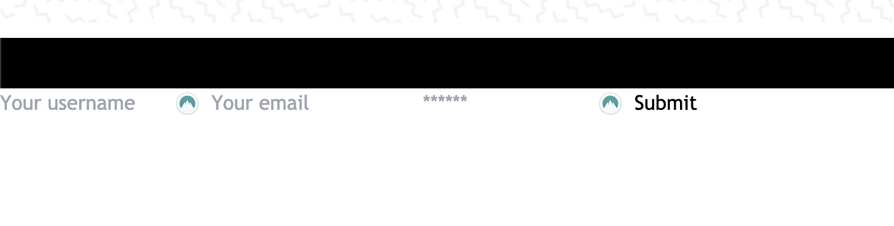
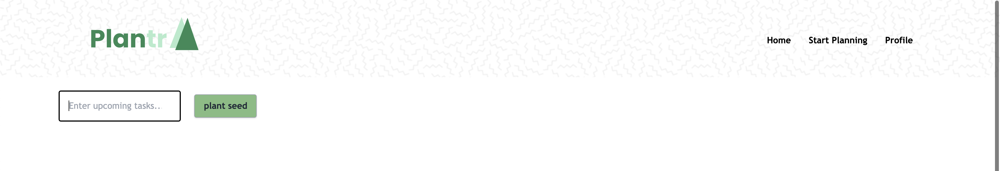
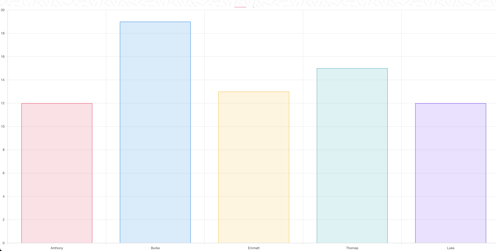

# MySQL Manatees
 

### Anthony Planisek

### Luke Spang

### Thomas Maxey

### Emmett Rushin

### Burke Beatty

 

## Live Application
https://productivityappunc.herokuapp.com/
 

    
## Description

This is a productivity app that's aimed at not only helping you keep on track with your daily, weekly, and monthly tasks, but it is also an app designed to help plant trees in order to counteract the devastating damages done by global warming. We used MERN stack to sew this application together. 

 

## License

This project/application is covered under the MIT license.

 

## Table of Contents

* [Install](#Install)
* [Usage](#Usage)
* [Features](#Features)
* [Contribute](#Contribute)
* [Questions](#Questions)

 
    

## Install

- Clone the GitHub repository
- Update the heroku route (if being run on local host)
- Add `.env` file with mongoDB info
- npm i dependencies (if being run on local host)

 

## Usage

This is a productivity application. Earn points as you complete tasks whether it is day to day or month to month. 
 

## Home Screen
The home screen has a transitional background with a nav bar featuring login, logout, and register buttons. All are dependent on the status of the user at that time. We also have the game modes featured in the middle of the screen. At this time we only have United States Cities, but we an easily expand to new modes soon. The search bar will also be implemented in the future to find friends. 
 

 

## Account Creation
 
The registration/account creation screen allows new users to create accounts in order to apply themselves to complete tasks on their own accord. This allows them to currently keep track of high score. In the future we want to incorporate a custom avatar/image for users to use for their account. 
 

 

## Task Page
 
The task page is designed to help you create custom tasks to help you keep track of your day to day lives. You will be presented with a task manager that you can add details, if needed, to whichever task you need to complete.
 

 

## Features
 
Some special features included in our productivity app include the the custom task manager where you can provide tasks along with any details you may want to include to help you stay on track. There is also a scoring system along with said tasks so you can see how you compare to other friends using the application. There is also a chart that helps you keep track of how you're doing compared to your friends!
 

 

## Contribute

Feel free to reach about ways that you can contribute to this game code, or extra features you would like to see added in the future. 

 

## Questions

If there are any questions regarding the repo, or any technical issues, please feel free to contact us at: MySQLManatees@gmail.com 